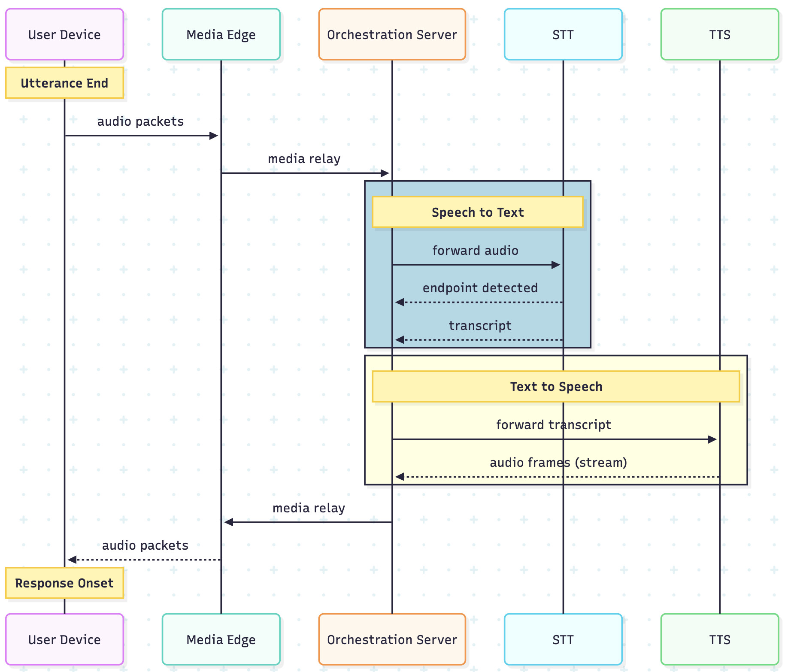

# Conversation Relay Echo Back

This application is a simple echo-back server for Twilio Conversation Relay. Whatever you say during a call is transcribed, forwarded directly to a TTS service, and then spoken back to you. The delay between when you stop speaking and when you hear the echoed response is the **turn-gap** latency.

Why is this useful? Because it lets you measure the end-to-end latency of a real voice agent pipeline. When you speak, your audio travels through:

1. Twilio’s voice network, carrying your voice in real time
2. Speech-to-Text (STT) transcription, turning speech into text
3. Through a websocket to your application
4. Text-to-Speech (TTS) synthesis, converting the text back into voice
5. Twilio’s network back to your ear

<p align="center">
  
</p>

## Getting Started

**1. Environment Variables**

Copy `.env.example` to `.env` and fill in the values:

```bash
cp .env.example .env
```

- `HOSTNAME` — your ngrok hostname only, e.g. `my-domain.ngrok-free.app`
- `ACCOUNT_SID` and `AUTH_TOKEN` — your Twilio credentials (used to start recordings).

**2. Start Ngrok**

You can try the helper script:

```bash
npm run grok
```

If it fails, just start ngrok normally in a separate terminal:

```bash
ngrok http 3000
```

Copy the hostname it prints (looks like `my-domain.ngrok-free.app`) into your `.env` as `HOSTNAME`.

**3. Configure your Twilio Number**

In the Twilio Console, set your phone number’s Voice → A Call Comes In webhook to your public URL: `https://my-domain.ngrok-free.app/incoming-call`

**4. Run It**

```bash
npm run dev
```

## Performing the Benchmark

### Perform a Call

1. Call your Twilio number.
2. Speak a complete sentence, then pause and wait.
   - Conversation Relay will send your transcript (`prompt`) to the server.
   - The server replies with a `text` token containing the same words.
   - Twilio speaks that text back to you. You’ll hear your own words after some delay.
3. Repeat a few times to get a feel for the end‑to‑end latency.

   > Note on latency: Some Conversation Relay speech models use semantic endpointing, which favors waiting for sentence boundaries before finalizing. That can increase latency—which is often desirable in real agents to avoid interrupting a user who is still speaking.

### Analyze the Turn Gap

After your call, the server logs a download link to the recording. Download it and open the file in [Audacity](https://www.audacityteam.org/)
or another audio editor.

To measure latency:

1. Zoom in on the waveform until you can clearly see the start and end of each speech segment.
2. Identify the point where you stop speaking (end of your waveform).
3. Find the point where the echoed playback begins (start of Twilio’s TTS waveform).
4. Use Audacity’s selection tool to measure the time gap between those two points.

That measured gap is your turn-gap latency — the actual round-trip time of the full audio pipeline (STT → application → TTS → network).
